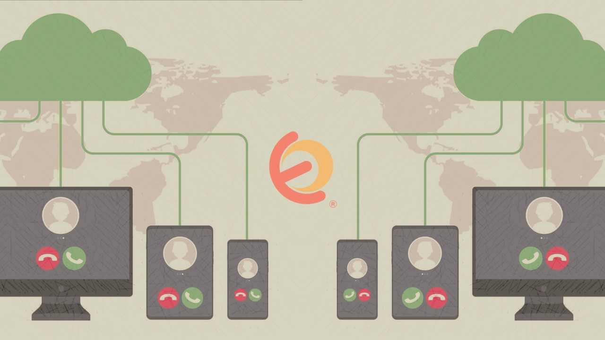

Udemy Course >> Elastix vs Issabel VoIP Systems SIP PBX Call Center Deploy

Elastix Asterisk VoIP Systems Deployment Issabel Call Center Installation and Configuration SIP and 3CX

**********

Tips/Tricks/Notes/Commands URL Link: 
https://github.com/nimaxnimax/Udemy_VoIP

Instructor & Courses >> 
https://www.udemy.com/user/adrian-fischer-infotech/

**********

Elastix

- Elastix is an open-source Unified Communications platform.
- It integrates various communication tools like VoIP, instant messaging, email, and fax.
- Elastix offers features such as call recording, conferencing, and interactive voice response (IVR).
- It is based on Asterisk, the leading open-source PBX (Private Branch Exchange) software.
- Elastix provides a user-friendly web interface for configuration and management.
- It supports a wide range of VoIP protocols including SIP (Session Initiation Protocol).
- Elastix is known for its flexibility and scalability, making it suitable for businesses of all sizes.
- The platform allows integration with third-party applications and services.
- Elastix is widely used for building cost-effective and feature-rich communication solutions.

**********

Elastix Advantages and Disadvantages

Advantages of Elastix:

- **Open-Source:** Elastix is freely available and open-source, allowing users to customize and modify the software according to their needs without licensing costs.
- **Feature-Rich:** It offers a comprehensive suite of communication tools, including VoIP, email, fax, instant messaging, and more, providing a one-stop solution for unified communications.
- **Scalability:** Elastix is designed to scale with the growth of the organization, making it suitable for businesses of all sizes, from small enterprises to large corporations.
- **User-Friendly Interface:** It provides an intuitive web-based interface for configuration and management, enabling users to easily set up and administer the system without extensive technical knowledge.
- **Community Support:** Being open-source, Elastix benefits from a large and active community of developers and users who contribute to its development, provide support, and share resources.

Disadvantages of Elastix:

- **Limited Updates:** Elastix development has slowed down in recent years, with the last major release in 2017. This may result in slower adoption of new features and potential security vulnerabilities.
- **Integration Challenges:** While Elastix offers integration with third-party applications, compatibility issues may arise with certain software or services, requiring additional customization or development effort.
- **Dependence on Asterisk:** Elastix is built on the Asterisk PBX platform, which may limit its flexibility compared to other VoIP solutions that are not tied to a specific underlying technology.
- **Complexity for Advanced Configurations:** While the user interface is user-friendly for basic configurations, setting up more advanced features or customizations may require deeper technical expertise, leading to potential challenges for less experienced users.
- **Lack of Official Support:** Unlike commercial solutions, Elastix does not offer official support or service level agreements, relying instead on community forums and documentation for assistance, which may be insufficient for mission-critical deployments.

**********

Issable

Issabel is an open-source Unified Communications platform and IP PBX solution that serves as an alternative to Elastix. It originated as a fork of Elastix, incorporating additional features and improvements while maintaining compatibility with Asterisk, the underlying PBX software. Issabel offers a comprehensive suite of communication tools, including VoIP, email, fax, instant messaging, and more, making it suitable for businesses of all sizes.

There are several reasons why someone might choose Issabel over Elastix:

1. **Active Development:** Issabel may benefit from more active development and ongoing updates compared to Elastix. This could provide users with access to new features, improvements, and security patches.

2. **Enhanced Features:** Issabel may include additional features or enhancements compared to Elastix, thanks to ongoing development efforts. These additional features could provide users with more flexibility and functionality for their communication needs.

3. **Community Support:** Like Elastix, Issabel benefits from a large and active community of developers and users who contribute to its development, provide support, and share resources. Users can find extensive documentation, tutorials, and community forums for assistance with Issabel deployments.

4. **Scalability and Performance:** Issabel is designed to scale with the growth of the organization, making it suitable for businesses of all sizes. It may offer better scalability or performance improvements compared to Elastix, depending on specific deployment requirements.

5. **User Interface:** Issabel may offer a similar or improved user interface compared to Elastix, potentially incorporating additional usability enhancements. This could make it easier for users to configure and manage their communication systems.

Ultimately, the decision to choose Issabel over Elastix or vice versa depends on factors such as specific feature requirements, development status, community support, and user preferences. Users should evaluate both platforms based on their needs and objectives before making a decision.

**********

Comparing Elastix and Issable

**Architecture:**
- Elastix is built on the Asterisk open-source PBX platform, offering a comprehensive suite of communication tools and features.
- Issabel is a fork of Elastix, incorporating additional features and improvements while maintaining compatibility with Asterisk.

**Features:**
- Both Elastix and Issabel offer a wide range of communication features, including VoIP, email, fax, instant messaging, and more.
- Issabel may include additional features or enhancements compared to Elastix, thanks to ongoing development efforts.

**User Interface:**
- Elastix provides a user-friendly web-based interface for configuration and management, allowing users to easily set up and administer the system.
- Issabel may offer a similar or improved user interface compared to Elastix, potentially incorporating additional usability enhancements.

**Scalability:**
- Both Elastix and Issabel are designed to scale with the growth of the organization, making them suitable for businesses of all sizes.
- Issabel may offer better scalability or performance improvements compared to Elastix, depending on the specific deployment requirements.

**Support and Updates:**
- Elastix development has slowed down in recent years, with the last major release in 2017, potentially leading to limited updates and slower adoption of new features.
- Issabel may benefit from more active development and ongoing updates, providing users with access to new features, improvements, and security patches.

**Community and Documentation:**
- Both Elastix and Issabel benefit from a large and active community of developers and users who contribute to their development, provide support, and share resources.
- Users can find extensive documentation, tutorials, and community forums for assistance with both Elastix and Issabel deployments.

**Integration and Compatibility:**
- Elastix and Issabel both offer integration with third-party applications and services, although compatibility issues may arise with certain software or configurations.
- Users may need to consider specific integration requirements or compatibility concerns when choosing between Elastix and Issabel for their deployments.

**********

SIP vs Trunking vs VoIP

- **SIP (Session Initiation Protocol):**
  - SIP is a signaling protocol used for initiating, maintaining, and terminating real-time sessions involving voice, video, and messaging applications over IP networks.
  - It facilitates communication between endpoints in VoIP systems, allowing devices to establish and control multimedia sessions.

- **Trunk:**
  - In telecommunication and VoIP, a trunk refers to a communication link or channel between two points, typically used to carry multiple signals simultaneously.
  - In VoIP systems, trunks are used to connect a PBX (Private Branch Exchange) to the PSTN (Public Switched Telephone Network) or to other VoIP systems.

- **VoIP (Voice over Internet Protocol):**
  - VoIP is a technology that enables voice communication and multimedia sessions over the Internet Protocol (IP) networks.
  - It converts analog voice signals into digital data packets and transmits them over IP networks, allowing users to make voice calls using the internet rather than traditional telephone lines.

- **Port Numbers:**
  - In networking, port numbers are used to identify specific processes or services running on a computer or network device.
  - In VoIP and SIP, port numbers are used to determine which application or service is responsible for handling incoming data packets.
  - Common port numbers used in VoIP and SIP implementations include 5060 for SIP signaling, 5061 for secure SIP (SIP over TLS), and a range of UDP and TCP ports for media traffic.

**********

How to Download and Install Elastix and Issable

Downloading and installing Elastix and Issabel involves several steps. Below are general instructions for each:

### Elastix:

1. **Visit the Elastix Website:**
   - Go to the official Elastix website at https://www.elastix.org/.

2. **Download the Elastix ISO:**
   - Look for the "Downloads" section on the website.
   - Choose the appropriate version of Elastix for your system (32-bit or 64-bit).
   - Click on the download link to start downloading the ISO file.

3. **Create Bootable Media:**
   - Once the ISO file is downloaded, you need to create a bootable USB drive or DVD from the ISO.
   - You can use software like Rufus (for USB drives) or ImgBurn (for DVDs) to create the bootable media.

4. **Boot from the Bootable Media:**
   - Insert the bootable USB drive or DVD into your computer.
   - Restart your computer and boot from the bootable media you created.

5. **Follow Installation Wizard:**
   - The Elastix installation wizard will guide you through the installation process.
   - Follow the on-screen instructions to select installation options such as language, keyboard layout, disk partitioning, etc.
   - Once installation is complete, remove the bootable media and restart your computer.

6. **Access Elastix Web Interface:**
   - After the system boots up, you can access the Elastix web interface by entering the IP address of your server in a web browser.
   - Follow the initial setup wizard to configure network settings, administrative credentials, and other basic configurations.

### Issabel:

1. **Visit the Issabel Website:**
   - Go to the official Issabel website at https://www.issabel.org/.

2. **Download the Issabel ISO:**
   - Look for the "Downloads" section on the website.
   - Choose the appropriate version of Issabel for your system (32-bit or 64-bit).
   - Click on the download link to start downloading the ISO file.

3. **Create Bootable Media:**
   - Once the ISO file is downloaded, create a bootable USB drive or DVD from the ISO using software like Rufus or ImgBurn.

4. **Boot from the Bootable Media:**
   - Insert the bootable USB drive or DVD into your computer.
   - Restart your computer and boot from the bootable media.

5. **Follow Installation Wizard:**
   - The Issabel installation wizard will guide you through the installation process.
   - Follow the on-screen instructions to select installation options such as language, keyboard layout, disk partitioning, etc.
   - Once installation is complete, remove the bootable media and restart your computer.

6. **Access Issabel Web Interface:**
   - After the system boots up, access the Issabel web interface by entering the IP address of your server in a web browser.
   - Follow the initial setup wizard to configure network settings, administrative credentials, and other basic configurations.

These steps provide a general overview of the download and installation process for Elastix and Issabel. Make sure to consult the official documentation for detailed instructions specific to your setup and requirements.

**********

Elastix URL Links

Elastix 2.5 Stable Version >> https://archive.org/download/Elastix2.5.0StableI386Bin21oct2014

Elastix 2.0 >> https://sourceforge.net/projects/elastix/files/Elastix%20PBX%20Appliance%20Software/5.0.0/

Installation Guide >> https://master.dl.sourceforge.net/project/elastix/Tutorials_Docs_Manuals/Elastix%202.0%20Guides/ELASTIX%202%20Installation%20Guide.pdf?viasf=1

Developyment >> https://master.dl.sourceforge.net/project/elastix/Tutorials_Docs_Manuals/Elastix%20Development%20Manual/development_manual-elastix-.pdf?viasf=1

Trunking and VPN >> https://master.dl.sourceforge.net/project/elastix/Tutorials_Docs_Manuals/Third%20Party%20Documentation/Elastix%20Interconection/Trunking%20Between%20Two%20Elastix%20-%20VPN.pdf?viasf=1

Trunking Internet >> https://master.dl.sourceforge.net/project/elastix/Tutorials_Docs_Manuals/Third%20Party%20Documentation/Elastix%20Interconection/Trunking%20Between%20Two%20Elastix%20%20-%20Internet.pdf?viasf=1

Elastix & Network Security >> https://master.dl.sourceforge.net/project/elastix/Tutorials_Docs_Manuals/Elastix%202.0%20Guides/Elastix%20_%20Network%20Security%20Guide.pdf?viasf=1

Elastix Fault Finding & General Techniques >> https://master.dl.sourceforge.net/project/elastix/Tutorials_Docs_Manuals/Elastix%202.0%20Guides/Elastix%20-%20Basic%20Fault%20Finding%20and%20Techniques.pdf?viasf=1

Elastix Bug Reporting Guidelines >> https://master.dl.sourceforge.net/project/elastix/Tutorials_Docs_Manuals/Elastix%20Bug%20Reporting%20Guidelines/Elastix%20Bug%20Reporting%20Guidelines%20v1_1.pdf?viasf=1

Elastix without Tears >> https://master.dl.sourceforge.net/project/elastix/Tutorials_Docs_Manuals/Elastix%20Without%20Tears/elastix_without_tears_june2010.pdf?viasf=1

Elastix Installation >> https://master.dl.sourceforge.net/project/elastix/Tutorials_Docs_Manuals/Elastix%20User%20Manual/elastix_installation_v1.3.2.pdf?viasf=1

**********

Issabel URL Links

Website >> https://www.issabel.org/

Download >> https://www.issabel.org/go/download

**********

VoIP & Softphones

3CX >> https://www.3cx.com/voip/softphone/

Pricing >> https://www.3cx.com/ordering/pricing/

Download >> https://portal.3cx.com/customer/downloads

Windows >> https://downloads-global.3cx.com/downloads/3CXPhoneforWindows16.msi

Zoiper >> https://www.zoiper.com/

Download >> https://www.zoiper.com/en/voip-softphone/download/current

Windows >> https://www.zoiper.com/en/voip-softphone/download/zoiper5/for/windows

Linux >> https://www.zoiper.com/en/voip-softphone/download/zoiper5/for/linux-deb

Mac >> https://www.zoiper.com/en/voip-softphone/download/zoiper5/for/mac

**********

